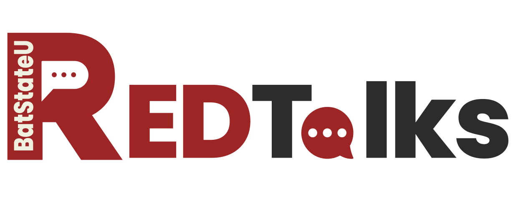

<p align="center">
  
</p>


# RedTalks 


RedTalks is an online community forum developed by Batangas State University (BSU) students for students within the same institution. It aims to create a community-driven forum that empowers students to vocalize their daily experiences and engagement within the institution. The core of the application will utilize multiple scoring algorithms such as <b> HotScore </b> and <b>Wilson Score </b> and other engagement metrics to calculate and rank posts based on their overall relevance, popularity, and user interaction, ensuring that the most engaging and timely content rises to the top in a fair and balanced manner.	
<br>

## Installation

Navigate to the desired directory and install the dependencies. 


``` powershell
    npm install-all
``` 

To start the application 

``` powershell
    npm run dev
```

<br>


## 🎯Features 


#### Organized Content 

&nbsp; RedTalks provides a structured digital forum where student discussions are systematically categorized and easily navigable, ensuring that conversations remain coherent and relevant to different aspects of campus life.

<br>


#### Anonymous Posting

&nbsp; Students can share their genuine thoughts, experiences, and perspectives without revealing their identity, creating a safe space for open and uninhibited communication within the Batangas State University community.  

<br>


#### Exclusive Community

&nbsp; By restricting access to only Batangas State University students, RedTalks fosters a trusted, intimate platform that promotes meaningful interactions and shared experiences specific to the institution's unique campus culture.


## ⚒️ Utilities


#### HotScore 

&nbsp; Ranking algorithm used to organize content based on their popularity. Largely reliant on the age of the post and the number of upvotes. 


``` powershell

    hotscore = (upvotes - downvotes) /  Math.pow(postAgeInSeconds + 2, 1.5)

```

This means that a post with a higher upvote and is more recent is more likely to appear on top of the home page. 


#### Engagement Score 

&nbsp; Ranking algorithm used to organize content based on their popularity. Engagement scores is primarily determined by upvotes, comments and relevancy. 

``` powershell

const engagementScore = (post.upvotes.length * upvoteWeight) + (post.comments.length * commentWeight);

```


#### Wilson Score

&nbsp;  The Wilson Score provides a more nuanced ranking of posts by accounting for both the number of upvotes and the proportion of positive votes, ensuring that posts are ranked not just by raw popularity, but by the statistical confidence of their positive reception. This approach prevents posts with a few highly positive votes from being artificially inflated, while also giving fair recognition to posts with consistently strong user approval.

``` powershell

    const finalScore = hotScore + wilsonScore * upvoteWeight + post.comments.length * commentWeight + recencyScore;

```


### Email Validation

&nbsp; RedTalks is an online platform exclusive to the students of Batangas State University. Since we don't have a realtime access to the school's database system, we can't implement a complete validation of the users in the platform. However, we do know that each student in the institution has their unique SR-code and email address. With that in mind, we implemented a regex pattern to match with the students' email address. 


``` powershell

emailPattern = /^\d{2}-\d{5}@g.batstate-u.edu.ph$/


```


## ⚙️Technology Stack and Tools

<b>Backend </b> <br>

- [x] Node.js <br>
- [x] Express.js <br>

<b> Database </b> </br>


- [x] MongoDB

<b>Frontend </b>

- [x] React


## 👷‍ Contributors<br>

| Name | Role | E-mail |
| --- | --- | --- |
| <a href = "https://github.com/DirkSteven">Dirk Steven E. Javier</a> | Project Manager/ Full-stack Developer | dirkjaviermvp@gmail.com | Allonsy -Discord |
| <a href = "https://github.com/LanceAndrei04">Ciavel Anby Montenegro </a>|  Backend Developer  | m.cap1218@gmail.com |
| <a href = "https://github.com/AeronEvangelista">John Bendict Tolentino </a>| Front-end Developer | jbtolentino.827.04@gmail.com |
| <a href = "https://github.com/mikaebora">Mikaella Ebora </a>| UI/UX | mikaellapebora@gmail.com |


<br>


##  <a id = "notes"> 📝 Notes </a><br>
<!-- [1] *** INSERT NOTE ***


